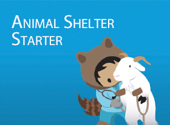

# Welcome to the Animal Shelter Starter Pack

## Introduction

Animal Shelter Starter Pack provides the foundation to use Salesforce for managing animals, treatments, conditions, housing and related activities.

The team within Salesforce.org have configured Animal, Action, Condition, Adoption and Exercise objects, along with Flows and Automation which you can install and adapt to your requirements, in addition, these are already linked to standard objects within Salesforce, such as Contacts and Accounts.

Animal Shelter Starter Pack is built to scale with your organisation, providing you with a foundation to begin managing your animals from rescue to recovery and beyond. Utilising the Salesforce platform, you will be able to take full control of your operations with the power of the world’s leading CRM.

## Your animal journey starts here

This application is **easy to install and easy to use**.
 
All you need is to install the application in your org from the AppExchange.

The app is free of use: open sourced, available on the AppExchange for free on GitHub.

Keep in mind that Animal Shelter Starter Pack is not a Salesforce product.  Support is based on open source participation and requests are managed (as we can) via GitHub at:  https://github.com/SalesforceLabs/AnimalShelterStarter/issues

## How Do I install
The application is available to install from the AppExchange

 

## How to get Support

- Source code is available to anyone at: https://github.com/SalesforceLabs/AnimalShelterStarter
- Join our Trailblazer Community Group at: https://sfdc.co/bixEKg

